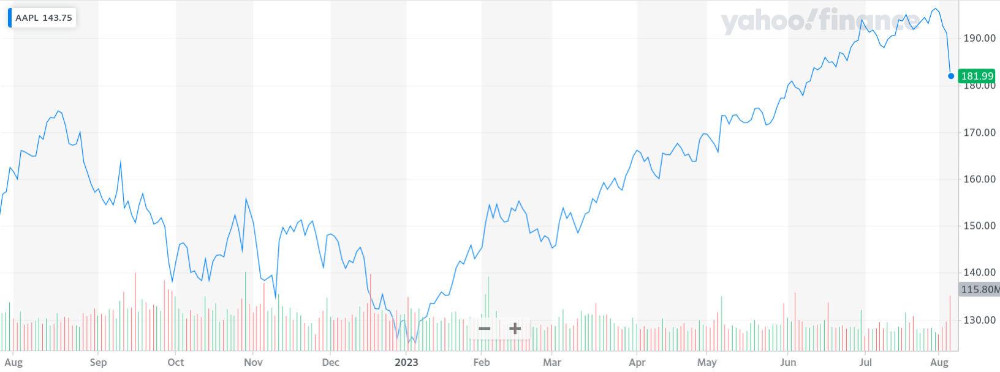
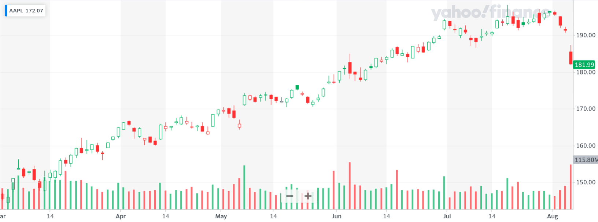
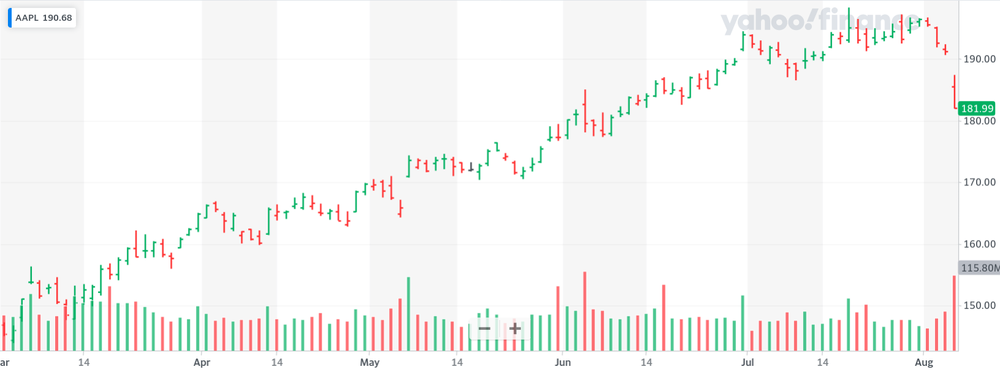
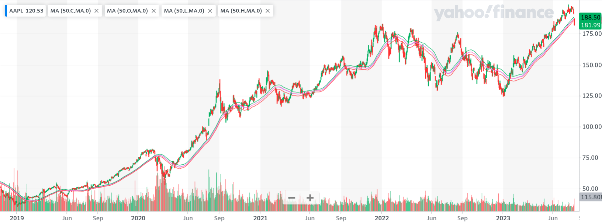
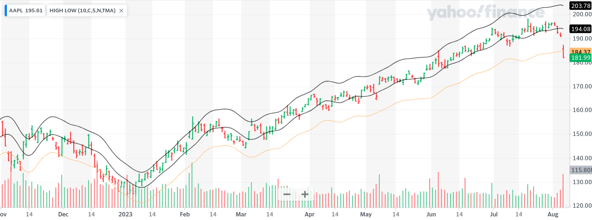
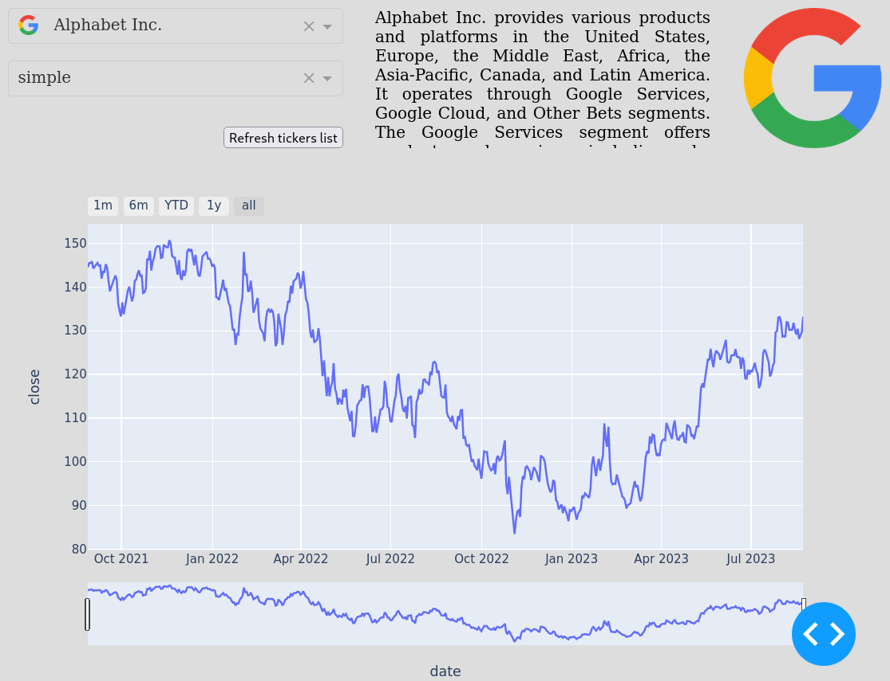
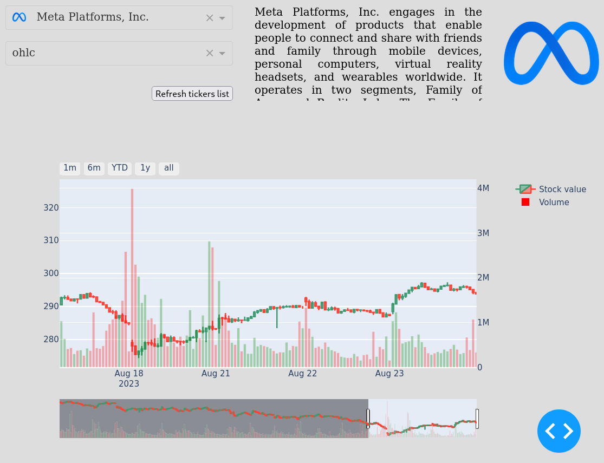
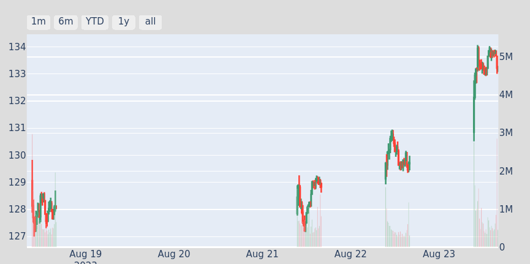

== Data report

=== Scope

This stage aims at the implementation of a dashboard that would display financial data of interest.

One can take inspiration from common financial tools to see what kind of visualization is usually used. Using the indicators labelled as "commonly used" on e.g. Yahoo Financefootnote:[https://finance.yahoo.com/chart/AAPL?guccounter=1] we can highlight a few characteristic graphs, such as :

* a simple trend line that joins the close values

.A trend line drawn from "close" valuefootnote:[retrieved from https://yhoo.it/3YrLHr2]

* a chart that displays open/close/high/low values with candlesticksfootnote:[https://datavizcatalogue.com/methods/candlestick_chart.html]. Green/red colors indicate whether the stock value has raised over that interval.

.A candlestick graphfootnote:[retrieved from https://yhoo.it/3QuHpwW]

* a chart that displays the same information with barsfootnote:[https://datavizcatalogue.com/methods/OHLC_chart.html]

.A bar graphfootnote:[retrieved from https://yhoo.it/3YrreCH]

* a chart with values smoothed via a moving average over several days

.Moving averagesfootnote:[retrieved from https://finance.yahoo.com/chart/AAPL#eyJpbnRlcnZhbCI6ImRheSIsInBlcmlvZGljaXR5IjoxLCJjYW5kbGVXaWR0aCI6MS43ODQwOTA5MDkwOTA5MDkyLCJmbGlwcGVkIjpmYWxzZSwidm9sdW1lVW5kZXJsYXkiOnRydWUsImFkaiI6dHJ1ZSwiY3Jvc3NoYWlyIjp0cnVlLCJjaGFydFR5cGUiOiJjb2xvcmVkX2JhciIsImV4dGVuZGVkIjpmYWxzZSwibWFya2V0U2Vzc2lvbnMiOnt9LCJhZ2dyZWdhdGlvblR5cGUiOiJvaGxjIiwiY2hhcnRTY2FsZSI6ImxpbmVhciIsInBhbmVscyI6eyJjaGFydCI6eyJwZXJjZW50IjoxLCJkaXNwbGF5IjoiQUFQTCIsImNoYXJ0TmFtZSI6ImNoYXJ0IiwiaW5kZXgiOjAsInlBeGlzIjp7Im5hbWUiOiJjaGFydCIsInBvc2l0aW9uIjpudWxsfSwieWF4aXNMSFMiOltdLCJ5YXhpc1JIUyI6WyJjaGFydCIsIuKAjHZvbCB1bmRy4oCMIl19fSwibGluZVdpZHRoIjoyLCJzdHJpcGVkQmFja2dyb3VuZCI6dHJ1ZSwiZXZlbnRzIjp0cnVlLCJjb2xvciI6IiMwMDgxZjIiLCJzdHJpcGVkQmFja2dyb3VkIjp0cnVlLCJldmVudE1hcCI6eyJjb3Jwb3JhdGUiOltdLCJzaWdEZXYiOnt9fSwic3ltYm9scyI6W3sic3ltYm9sIjoiQUFQTCIsInN5bWJvbE9iamVjdCI6eyJzeW1ib2wiOiJBQVBMIiwicXVvdGVUeXBlIjoiRVFVSVRZIiwiZXhjaGFuZ2VUaW1lWm9uZSI6IkFtZXJpY2EvTmV3X1lvcmsifSwicGVyaW9kaWNpdHkiOjEsImludGVydmFsIjoiZGF5Iiwic2V0U3BhbiI6bnVsbH1dLCJjdXN0b21SYW5nZSI6bnVsbCwic3R1ZGllcyI6eyLigIx2b2wgdW5kcuKAjCI6eyJ0eXBlIjoidm9sIHVuZHIiLCJpbnB1dHMiOnsiaWQiOiLigIx2b2wgdW5kcuKAjCIsImRpc3BsYXkiOiLigIx2b2wgdW5kcuKAjCJ9LCJvdXRwdXRzIjp7IlVwIFZvbHVtZSI6IiMwMGIwNjEiLCJEb3duIFZvbHVtZSI6IiNmZjMzM2EifSwicGFuZWwiOiJjaGFydCIsInBhcmFtZXRlcnMiOnsid2lkdGhGYWN0b3IiOjAuNDUsImNoYXJ0TmFtZSI6ImNoYXJ0IiwicGFuZWxOYW1lIjoiY2hhcnQifX0sIuKAjG1h4oCMICg1MCxDLG1hLDApIjp7InR5cGUiOiJtYSIsImlucHV0cyI6eyJQZXJpb2QiOjUwLCJGaWVsZCI6IkNsb3NlIiwiVHlwZSI6InNpbXBsZSIsIk9mZnNldCI6MCwiaWQiOiLigIxtYeKAjCAoNTAsQyxtYSwwKSIsImRpc3BsYXkiOiLigIxtYeKAjCAoNTAsQyxtYSwwKSJ9LCJvdXRwdXRzIjp7Ik1BIjoiI2FkNmVmZiJ9LCJwYW5lbCI6ImNoYXJ0IiwicGFyYW1ldGVycyI6eyJjaGFydE5hbWUiOiJjaGFydCJ9fSwi4oCMbWHigIwgKDUwLE8sbWEsMCkiOnsidHlwZSI6Im1hIiwiaW5wdXRzIjp7IlBlcmlvZCI6NTAsIkZpZWxkIjoiT3BlbiIsIlR5cGUiOiJzaW1wbGUiLCJPZmZzZXQiOjAsImlkIjoi4oCMbWHigIwgKDUwLE8sbWEsMCkiLCJkaXNwbGF5Ijoi4oCMbWHigIwgKDUwLE8sbWEsMCkifSwib3V0cHV0cyI6eyJNQSI6IiNmZjgwYzUifSwicGFuZWwiOiJjaGFydCIsInBhcmFtZXRlcnMiOnsiY2hhcnROYW1lIjoiY2hhcnQifX0sIuKAjG1h4oCMICg1MCxMLG1hLDApIjp7InR5cGUiOiJtYSIsImlucHV0cyI6eyJQZXJpb2QiOjUwLCJGaWVsZCI6IkxvdyIsIlR5cGUiOiJzaW1wbGUiLCJPZmZzZXQiOjAsImlkIjoi4oCMbWHigIwgKDUwLEwsbWEsMCkiLCJkaXNwbGF5Ijoi4oCMbWHigIwgKDUwLEwsbWEsMCkifSwib3V0cHV0cyI6eyJNQSI6IiNmZjMzM2EifSwicGFuZWwiOiJjaGFydCIsInBhcmFtZXRlcnMiOnsiY2hhcnROYW1lIjoiY2hhcnQifX0sIuKAjG1h4oCMICg1MCxILG1hLDApIjp7InR5cGUiOiJtYSIsImlucHV0cyI6eyJQZXJpb2QiOjUwLCJGaWVsZCI6IkhpZ2giLCJUeXBlIjoic2ltcGxlIiwiT2Zmc2V0IjowLCJpZCI6IuKAjG1h4oCMICg1MCxILG1hLDApIiwiZGlzcGxheSI6IuKAjG1h4oCMICg1MCxILG1hLDApIn0sIm91dHB1dHMiOnsiTUEiOiIjMDBiMDYxIn0sInBhbmVsIjoiY2hhcnQiLCJwYXJhbWV0ZXJzIjp7ImNoYXJ0TmFtZSI6ImNoYXJ0In19fSwic2V0U3BhbiI6bnVsbCwicmFuZ2UiOm51bGx9[here]]

* a chart with high/low bands (indicating the extremas of the stock value)

.High-low bandsfootnote:[retrieved from https://yhoo.it/3OHdArD]

We can also notice that charts by default include a bar chart that indicates the volume of stocks exchanged on the market on a given period.

We will try to reproduce those kinds of charts in the project. More elaborate visualizations are obviously available, but they are out of scope.

=== Tool

To realize this step we will be using Dashfootnote:[https://dash.plotly.com/], an open-source data-visualization framework that implement React components over the Javascript library Plotly.jsfootnote:[https://github.com/plotly/plotly.js] (by using Plotly.pyfootnote:[https://plotly.com/python/] as a Python API).

It aims at letting users to write interactive data visualizations by writing nothing else but Python code ; this is achieved by a mechanism of callbacks that can be triggered on mutation of any part of the page layout, and allows to update any part of the page as a response.

It is widely used, backed up and supported by a dedicated company, and has a huge community.

=== Implementation

The kind of charts we aim to draw are very well supported by Dash. Line charts are obviously super simple to implement, and candlestick/OHLC graphs are also available out-of-the-box. Charts that imply e.g. moving averages have not been implemented though, because they require a bit more work in terms of data manipulation.

The UI we have chosen is quite simple. The graph displays only one kind of data at a time (e.g. OHLC data for Google), and 2 dropdowns allow to switch company and to switch between a trend line and OHLC chart (which also displays volume). Hovering over the graph displays the values at the current time. Navigation through the graph can be done via a range selector and some buttons that allow to display e.g. 1 month or 1 year of data.

.Dashboard displaying historical close value for Alphabet

.Dashboard displaying OLHC values for Meta

Care has been taken to display the data in a visually pleasant way, using e.g. rangebreaks that allow to present the timeseries in a continuous way even though they are not (the stock market opens only from 9:00 to 16:30 on weekdays). The layout has been slightly altered using some CSS.

.Dashboard without rangebreaks

=== Alternative solutions
