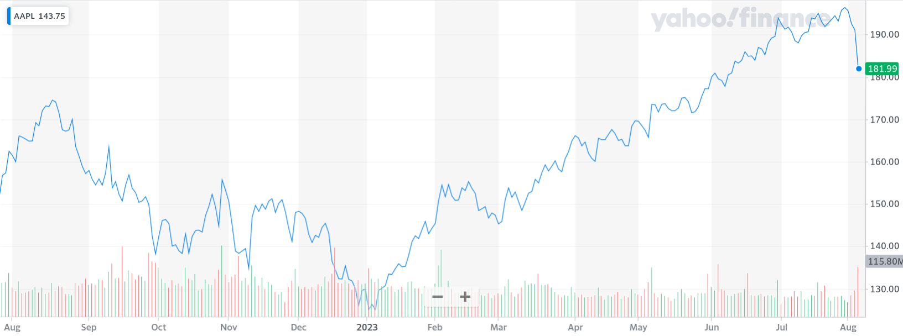

# Context

## The initial situation

## Final architecture

## Some vocabulary

::: incremental

* **ticker** / **symbol**
    * a unique short identifer for a company stock
    * AAPL => Apple, MSFT => Microsoft, META => Meta
* **OHLC** :
    * "open", "high", "low", "close"
    * as opposed to "simple" (*my own wording*)
* **volume** :
    * the number of stock values exchanged
    * characterizes the activity on a given stock

:::

# The external API

## What we start with

## Choosing the data provider

##

::: demo
:::

## External API

::: incremental

* Slow
* API is limited (~250 hits/day)
* No custom querying (e.g. several tickers)

:::

# Caching the data

## Before

## Adding a local cache

##

::: demo
:::

## Data reader and local storage

::: incremental

* Data is retrieved once and for all
* No more API limits
* Data can be queried in powerful ways

:::

# Adding an HTTP API

## Before

## Adding the API

##

::: demo
:::

[connect to [http://63.35.39.206:8000/docs](http://63.35.39.206:8000/docs)]

## HTTP API

::: incremental

* Allows access to third-parties
* Extensible at will
* Secure

:::

# Data dashboard

## Inspiration (1)

## Inspiration (2)

##

::: demo
:::

[connect to [http://63.35.39.206:8050/](http://63.35.39.206:8050)]

## Wait !

What if we want to add a new value ?

* Nvidia
* Pepsi
* Adobe
* Netflix

# Thanks for your attention !

# Extras

## Tests

::: incremental

* Unit (module-level)
* Integration (with the database)
* Functional (e.g. checks that the API works)

:::

##

::: demo
:::

## Interactive shell

Very useful for development and quick debugging !

##

::: demo
:::
